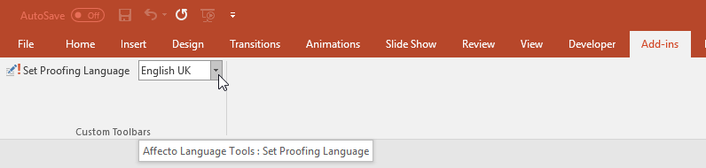

# PowerPoint Add-in
The add-in will select all text objects in the presentation and change the proofing language to 

# How to install it
## Windows users
Download the SetProofingLanguageAddIn.ppam file and save it to 
    %USERPROFILE%\AppData\Roaming\Microsoft\AddIns

## MAC users
I have no idea. Suggestions?

# How to use it
Go to Add-ins, select the language and click Set Proofing Language.

# Background
If you work in international environments, trying to spell-check a PowerPoint presentation is a nightmare - PowerPoint doesn't have a way to select EVERY text in the presentation - this includes smart shapes, text boxes, titles, tables etc Using "slide sorter" does not work either, at least for me.

# Disclaimer
This is quick hack, be sure to try out first in a copy of a document. Use it at your own risk.